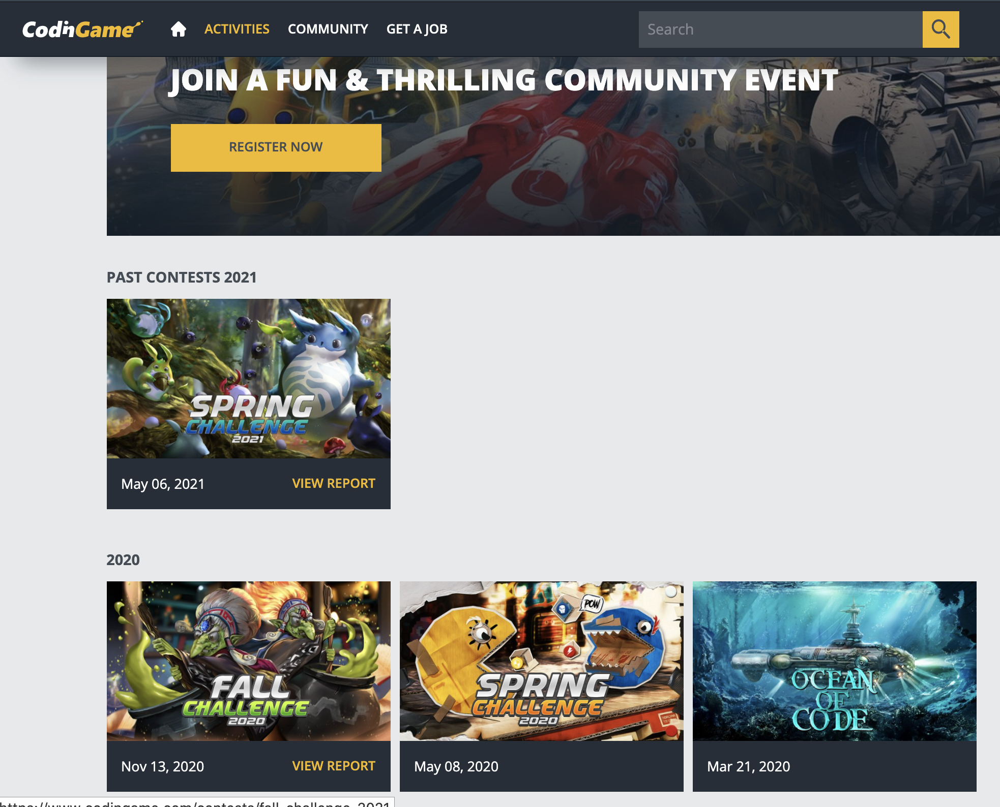
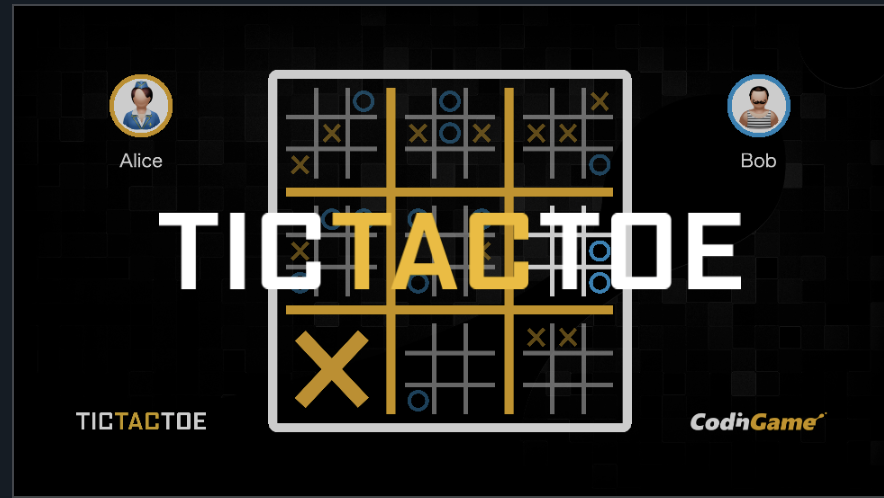
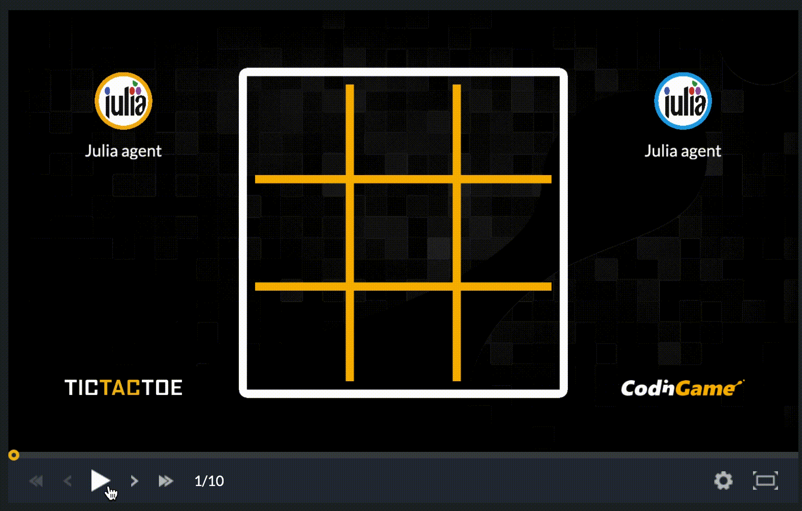
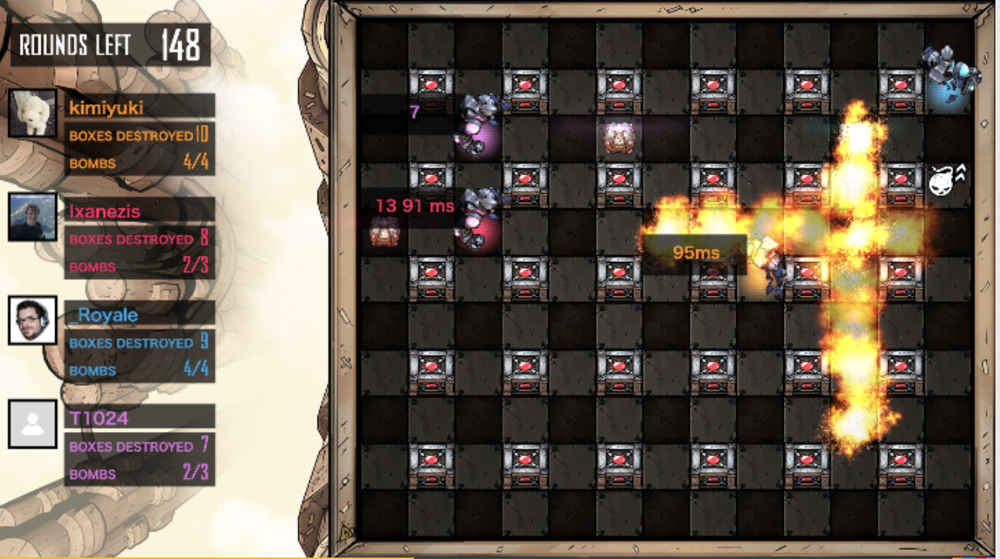

# Juliaで遊ぶ！ゲームAI

---

## 自己紹介

- 塚本真人
- 株式会社Fusic
- 普段はRoRでweb開発してます
- 趣味: ポケモン
- qiita: https://qiita.com/TsuMakoto
- github: https://github.com/TsuMakoto
- jl.devというユーザーグループで管理人しています
  - https://jldev.connpass.com
  - Discord: https://discord.gg/NwTE3yg

 

---

# アジェンダ

1. ゲームAIとは？
2. CodingameでゲームAI
3. ultimate-tictactoe
4. 自作Juliaコードを動かす
5. コミット！！
6. 競いましょう！

---

# ゲームAIとは？

## 簡単に言うと、NPCを作ること

定義自体は曖昧らしいですが、

決まったゲームの環境で自律して動くキャラクターを指します

---

# CodingameでゲームAI



---

# Codingameについて

- 実際に存在する？ゲームを題材にしたゲームのNPCを作れるサービス
- C++や、Ruby、Goなど23言語から利用
- 世界中のプレイヤーと対戦して、ランキングを競うゲームAI開発サイト


---

# ultimate-tictactoe
3x3のマルバツゲーム
https://www.codingame.com/multiplayer/bot-programming/tic-tac-toe



ユーザー登録してしまえば、簡単に始められます。

---

# 自作コードを動かす

---

# 自作コードを動かす

- 23言語使えるといいましたが、Juliaが使えない！

- せっかくなら、Juliaを使いたいよね。

- 難しいことはしてないよ。

---

# localで実行する
数は限られいますが、ゲームをローカルで動かすことができます。

- github: https://github.com/CodinGame/game-ultimate-tictactoe
- 実行環境: Java (Maven)
- [GitHub - TsuMakoto/game-ultimate-tictactoe](https://github.com/TsuMakoto/game-ultimate-tictactoe/tree/master)から`docker-compose up`でもOK

---

# コミット！！
[game-ultimate-tictactoe/Main.java at master · CodinGame/game-ultimate-tictactoe · GitHub](https://github.com/CodinGame/game-ultimate-tictactoe/blob/master/src/test/java/Main.java)のなかのコードを編集する。

```java
// ...略

gameRunner.addAgent(Player1.class);
gameRunner.addAgent(Player2.class);
// gameRunner.addAgent("python3 /home/user/player.py");

gameRunner.start();

// ...
```
---

# コミット！！
[game-ultimate-tictactoe/Main.java at master · CodinGame/game-ultimate-tictactoe · GitHub](https://github.com/CodinGame/game-ultimate-tictactoe/blob/master/src/test/java/Main.java)のなかのコードを編集する。

```java
// ...略

gameRunner.addAgent(Player1.class);
// gameRunner.addAgent(Player2.class);
gameRunner.addAgent("julia /home/user/player.jl"); // ここで使いたいagentを追加

gameRunner.start();

// ...
```

---

# コミット!!

https://github.com/TsuMakoto/game-ultimate-tictactoe/blob/master/src/test/julia/player.jl

```
module Turn

function start(grid::Matrix{Int})
  opponentrow, opponentcol = parse.(Int, readline() |> split)

  if (opponentrow, opponentcol) != (-1, -1)
    grid[opponentrow + 1, opponentcol + 1] = 2
  end

  valid_action_count = parse.(Int, readline())
  actions = map(1:valid_action_count) do i
    parse.(Int, readline() |> split)
  end

  # AI作成...
```

---

# 結果




---

# 他のゲームもできる
基本、 `src/test/java/Main.java` のファイルを編集すればできます。




---

# 競いましょう！

- いつかjl.devで、イベントとしてやるかもしれません。
  - コード提出のフォームは頑張って作ります。
- 戦略やアルゴリズムに興味ある方、Juliaを学んでみたい方参加待ってます。

---

# ありがとうございました

リポジトリ

- 発表資料:   https://github.com/TsuMakoto/OSC2021OnlineNagoya
- デモコード: https://github.com/TsuMakoto/game-ultimate-tictactoe

